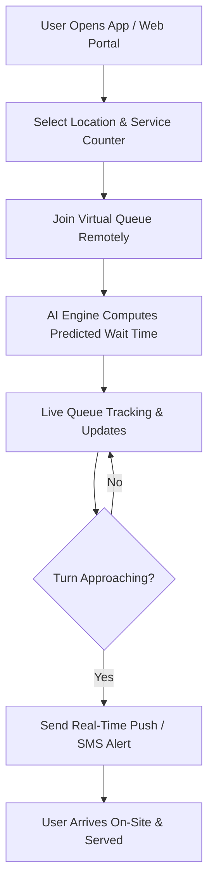

# SmartQ – AI-Powered Virtual Queue Management System 🚀

> **SmartQ** is a next-generation Virtual Queue and Behavior Prediction platform designed to eliminate physical waiting lines in high-footfall institutions such as hospitals, banks, and government offices. By combining remote queue joining with real-time AI wait-time prediction, SmartQ transforms the customer and patient waiting experience.

---

## 📌 Executive Summary

Traditional physical queuing systems force people to stand in long, unpredictable lines, leading to wasted time, overcrowded waiting areas, increased stress, and operational bottlenecks for staff. **SmartQ** bridges this gap by allowing visitors to join queues remotely from their smartphones or web browsers, track their live position in real-time, and receive AI-predicted wait times based on historical visit patterns, counter availability, and live queue movement.

---

## 🛑 Problem Statement

### 1. What is the Problem?
Hospitals, banks, and government offices continuously struggle with long, physical queues. Visitors have no visibility into true wait times, forcing them to either arrive hours early or risk missing their turn. Staff lack foresight into incoming traffic, resulting in overcrowded, noisy waiting areas—which, particularly in healthcare settings, poses significant health and safety risks.

### 2. Who is Affected?
- **Visitors, Patients & Customers:** Suffer from wasted hours, anxiety, and exposure to crowded public spaces.
- **Service Institutions:** Burdened with chaotic waiting rooms, frustrated clients, and inefficient staff/counter utilization.

### 3. Why it Matters
Static token dispensers and physical lines are obsolete in an era of mobile-first convenience. Overcrowding degrades service quality, reduces operational efficiency, and creates unnecessary public health hazards.

---

## 💡 The SmartQ Solution

SmartQ delivers an integrated **Virtual Queue + Behavior Prediction System**:

* 📲 **Remote Queue Joining:** Join queues remotely via a mobile application or web portal without being physically present on-site.
* 🤖 **AI-Driven Wait Time Prediction:** Utilizes a predictive machine learning model trained on historical visit data, time-of-day dynamics, active counter availability, and live queue velocity.
* 🔔 **Real-Time Dynamic Alerts:** Pushes timely notifications as the user's turn approaches, allowing them to arrive *just in time*.
* 🌐 **Unified Multi-Industry Platform:** Adaptable across diverse sectors including healthcare, financial services, and public administration.

---

## ⚙️ How It Works

### Key Functional Highlights
1. **Remote Ticketing & Virtual Token:** Users secure a queue token directly from their phone before traveling.
2. **Behavioral AI Inference Engine:** Continually re-evaluates and refines estimated wait times based on live counter processing speeds and customer arrival trends.
3. **Smart Distance & Time Buffer:** Recommends optimal departure times so users arrive right before their token is called.
4. **Staff Management Portal:** Gives institution administrators real-time visibility into footfall, service bottlenecks, and counter performance.

---

## 🌟 Unique Value Proposition (UVP)

Unlike conventional static token systems that offer fixed, inaccurate estimates:
* **Predictive vs. Static:** SmartQ learns from real historical behavior and live queue dynamics rather than static timers.
* **Crowd Reduction:** Significantly minimizes physical waiting room density, improving health safety and comfort.
* **Cross-Sector Standardization:** Works as a single, scalable platform across hospitals, clinics, banks, and government agencies.

---

## 🎯 Target Markets & Applications

| Industry | Use Case | Impact |
| :--- | :--- | :--- |
| 🏥 **Healthcare & Clinics** | Patient registration, Outpatient OPD queues, Lab reports | Reduces waiting room contagion risk & patient stress |
| 🏦 **Banking & Finance** | Teller counters, Customer support, Loan consultations | Improves customer satisfaction & branch throughput |
| 🏛️ **Government Services** | Passport/ID offices, Licensing, Municipal counters | Eliminates early morning crowding & streamlines footfall |
| 🛍️ **Future Scope** | Telecom centers, Airport check-ins, Retail service desks | Scalable queuing layer for all walk-in services |

---

## 📈 Business Model & Strategy

* **Revenue Model:** B2B SaaS subscription model tiered by number of counters, locations, and Monthly Active Users (MAU).
* **Analytics Add-On:** Premium analytics modules for institutional capacity planning and staff optimization.
* **Pilot Tier:** Low-barrier onboarding tier designed for smaller clinics and community service centers.

---

## 🗺️ Future Roadmap

- [x] **Phase 1 (Short-Term):** MVP development & pilot testing with partner institutions (clinic + bank branch).
- [ ] **Phase 2:** Refinement of AI prediction engine with real-world queue datasets & user experience enhancements.
- [ ] **Phase 3 (Long-Term):** Expansion into telecom outlets, retail centers, and transport hubs to build the universal digital queuing layer.
- [ ] **Phase 4:** Kiosk integration & voice accessibility features for non-smartphone users.

---

## 👥 Team Creonyx

Formed for **CODE WITH WIE 2026**, Team **Creonyx** brings together passion, innovation, and technical expertise to solve everyday public challenges.

| Name | Role | Contact |
| :--- | :--- | :--- |
| **Mogith Chandrakumar** | 👑 Team Leader | [kmogith1@gmail.com](mailto:kmogith1@gmail.com) \| 📞 0764096073 |
| **Renujaan Ravichandran** | 💻 Team Member | — |
| **Kathirsan Vivekanantharaja** | 💻 Team Member | — |
| **Rubashalini Rubarajan** | 💻 Team Member | — |
| **Asvinitha Thevaraja** | 💻 Team Member | — |

---

## 📄 License

This project is submitted for **CODE WITH WIE 2026** by Team **Creonyx**. All rights reserved.

